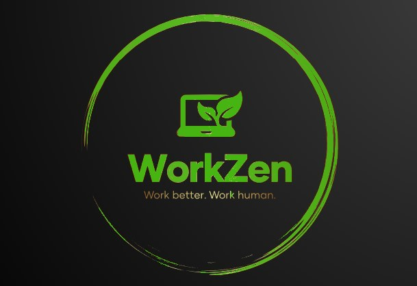
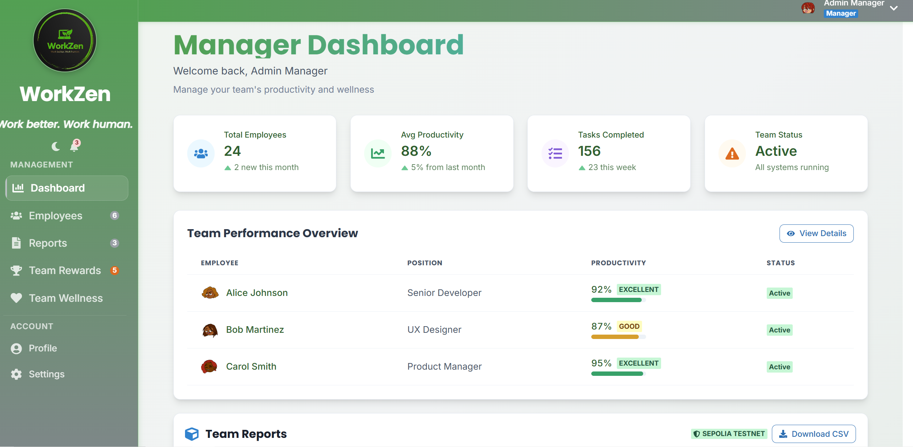
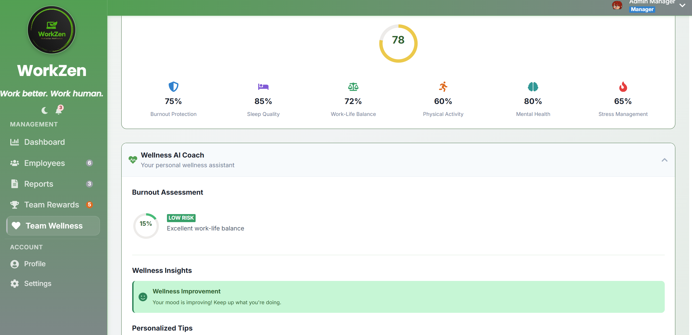
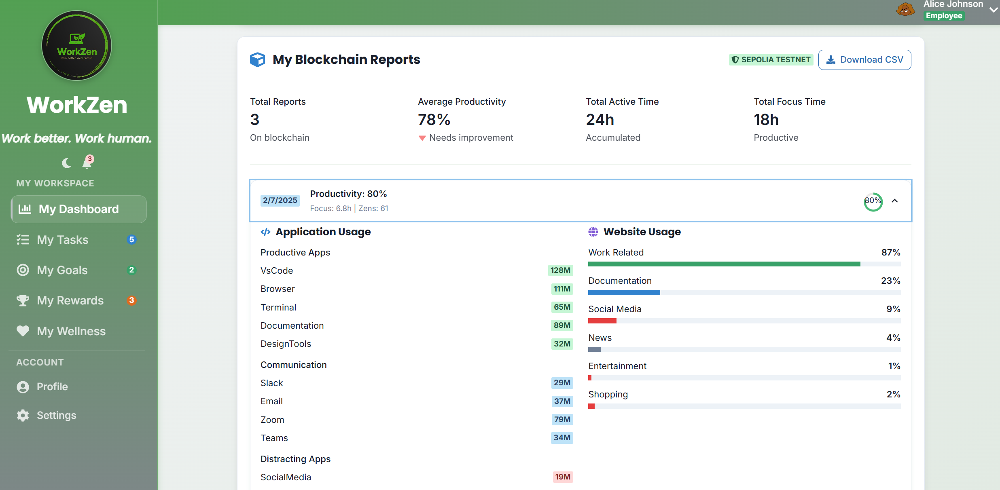
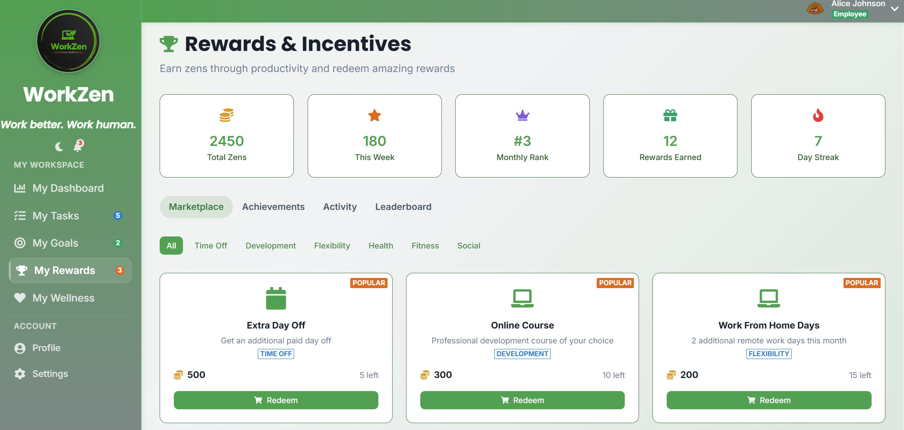

# WorkZen - AI-Powered Productivity Monitor with Blockchain

<div align="center">
  
</div>

**Next-generation employee productivity tracking with AI analytics, blockchain verification, and mindful workplace practices.**

  

## 🚀 **Features**

### 🤖 **AI-Powered Analytics**
- Intelligent productivity scoring with machine learning
- Pattern recognition for optimal work schedules
- Personalized recommendations based on behavior analysis
- Predictive insights for performance optimization

### 🔗 **Blockchain Integration**
- Smart contracts on Sepolia Testnet
- Immutable activity records with Ethereum verification
- Transparent reward system with Zen points (not tokens)
- MetaMask integration for Web3 connectivity
- Real-time transaction verification on Etherscan

### 📊 **Advanced Monitoring**
- Native desktop agent for real-time PC tracking
- Web activity monitoring with privacy-first approach
- Application usage analytics with categorization
- Focus time optimization with break recommendations

### 🎮 **Gamification & Rewards**
- Zen points system
- Achievement unlocking based on productivity milestones
- Team leaderboards with competitive elements
- Benefit marketplace for point redemption

## 🛠️ **Tech Stack**

**Frontend:**
- React 18 + Next.js 13
- Chakra UI + Framer Motion
- Web3.js + Ethers.js + MetaMask integration

**Backend:**
- Node.js + Express
- Native desktop monitoring agent
- Real-time WebSocket connections

**Blockchain:**
- Ethereum Sepolia Testnet
- Smart contracts for data verification
- IPFS for decentralized storage

**AI/ML:**
- Custom productivity algorithms
- Pattern recognition engines
- Predictive analytics models

## 🎯 **Architecture Overview**

```
┌─────────────────┐    ┌──────────────────┐    ┌─────────────────┐
│   Native Agent  │───▶│   WorkZen API    │───▶│  Blockchain     │
│   (Desktop)     │    │   (Backend)      │    │  (Sepolia)      │
└─────────────────┘    └──────────────────┘    └─────────────────┘
         │                        │                        │
         ▼                        ▼                        ▼
┌─────────────────┐    ┌──────────────────┐    ┌─────────────────┐
│   Dashboard     │───▶│   AI Analytics   │───▶│   MetaMask      │
│   (React)       │    │   (ML Engine)    │    │   (Wallet)      │
└─────────────────┘    └──────────────────┘    └─────────────────┘
```

## 🚀 **Quick Start**

### Prerequisites
- Node.js 18+
- MetaMask browser extension
- Git

### Installation

```bash
# Clone repository
git clone https://github.com/Reaxtiv/workzen.git
cd workzen

# Install dependencies
npm install

# Install native agent dependencies
cd agentzen && npm install && cd ..

# Set up environment variables
cp .env.example .env.local
# Edit .env.local with your configuration

# Start development servers
npm run dev           # Frontend (localhost:3000)
npm run backend       # API Server (localhost:4000)
npm run agent         # Native monitoring agent
```

### Environment Variables
```bash
# .env.local
NEXT_PUBLIC_CONTRACT_ADDRESS=0xA08751DEf5106FD658ce18E10bae948f8cdBFEF2
NEXT_PUBLIC_SEPOLIA_RPC_URL=https://sepolia.infura.io/v3/YOUR_PROJECT_ID
NEXT_PUBLIC_ETHERSCAN_API_KEY=your_etherscan_api_key
```

### Blockchain Setup

1. Install MetaMask and connect to Sepolia Testnet
2. Get Sepolia ETH from faucet: https://sepoliafaucet.com/
3. Connect wallet in WorkZen dashboard
4. Smart contract deployed at: `0xA08751DEf5106FD658ce18E10bae948f8cdBFEF2`

## 📱 **Usage**

### For Employees:
1. Connect MetaMask wallet
2. Start native monitoring agent
3. View real-time productivity metrics
4. Earn Zen points for productive behavior
5. Redeem rewards in benefit marketplace

### For Administrators:
1. Access admin dashboard at `/admin/dashboard-simple`
2. View team productivity analytics
3. Monitor blockchain-verified reports
4. Export detailed CSV reports
5. Manage reward distribution

## 🔗 **Blockchain Features**

### Smart Contract Functions:
- `submitDailyReport()` - Store verified productivity data
- `getEmployeeStats()` - Retrieve verified metrics
- `hasReportForDate()` - Check report existence
- Automated daily report submission

### Verification:
- All reports are cryptographically signed
- Immutable audit trail on Sepolia blockchain
- Public verification via [Etherscan](https://sepolia.etherscan.io/address/0xa08751def5106fd658ce18e10bae948f8cdbfef2)
- Decentralized data integrity

## 🤖 **AI Analytics**

### Productivity Intelligence:
- Real-time scoring based on activity patterns
- Optimal work schedule predictions
- Focus time optimization recommendations
- Burnout prevention early warning system

### Machine Learning Models:
- Activity classification (productive vs. distraction)
- Time series analysis for trend prediction
- Anomaly detection for unusual patterns
- Personalization engine for individual insights

## 📊 **Dashboard Features**

### Employee View:
- Real-time productivity metrics
- AI-generated insights and recommendations
- Blockchain transaction history
- Zen points balance and rewards
- Personal productivity trends

### Admin View:
- Team productivity overview
- Blockchain-verified reports
- CSV export functionality
- Employee performance analytics
- Reward distribution management

## 📸 **Screenshots**

### WorkZen Dashboard


### Analytics Panel


### Admin Panel


### MetaMask Integration


## 🎯 **Project Structure**

```
workzen/
├── src/
│   ├── components/           # React components
│   │   ├── Layout.js        # Main layout wrapper
│   │   ├── Sidebar.js       # Navigation sidebar
│   │   ├── TopBar.js        # Header component
│   │   └── BlockchainReports.js  # Blockchain data display
│   ├── pages/
│   │   ├── admin/           # Admin dashboard pages
│   │   └── employee/        # Employee dashboard pages
│   ├── services/
│   │   └── BlockchainReporter.js  # Blockchain integration
│   └── utils/               # Utility functions
├── agentzen/                # Native desktop agent
├── contracts/               # Smart contracts
└── public/                  # Static assets
```

## 🔧 **API Endpoints**

### Blockchain Endpoints:
- `POST /api/blockchain/submit-report` - Submit daily report
- `GET /api/blockchain/employee-stats/:address` - Get employee statistics
- `GET /api/blockchain/reports/:address` - Get employee reports
- `GET /api/blockchain/admin/all-reports` - Get all employee reports (admin)

### Analytics Endpoints:
- `GET /api/analytics/productivity` - Real-time productivity data
- `GET /api/analytics/trends` - Historical trends
- `POST /api/analytics/predict` - AI predictions

## 🎯 **Roadmap**

- <input type="checkbox" disabled checked> Basic productivity tracking
- <input type="checkbox" disabled checked> Blockchain integration with Sepolia
- <input type="checkbox" disabled checked> AI analytics engine
- <input type="checkbox" disabled checked> Native desktop agent
- <input type="checkbox" disabled checked> MetaMask integration
- <input type="checkbox" disabled checked> Smart contract deployment
- <input type="checkbox" disabled> Advanced AI predictions
- <input type="checkbox" disabled> Mobile app companion
- <input type="checkbox" disabled> Integration APIs
- <input type="checkbox" disabled> Advanced reporting
- <input type="checkbox" disabled> Multi-language support
- <input type="checkbox" disabled> Enterprise features
- <input type="checkbox" disabled> Custom smart contracts
- <input type="checkbox" disabled> Multi-chain support (Polygon, BSC)
- <input type="checkbox" disabled> Advanced AI models
- <input type="checkbox" disabled> Professional services
- <input type="checkbox" disabled> Global deployment
- <input type="checkbox" disabled> Enterprise partnerships
- <input type="checkbox" disabled> Advanced analytics suite
- <input type="checkbox" disabled> Custom integrations

## 🔒 **Security & Privacy**

### Data Protection:
- GDPR compliant data handling
- End-to-end encryption for sensitive data
- User consent management system

### Blockchain Security:
- Multi-signature wallets for admin functions
- Smart contract auditing (planned)
- Gas optimization for cost efficiency
- Reentrancy protection in contracts

## 🤝 **Contributing**

1. Fork the repository
2. Create feature branch (`git checkout -b feature/amazing-feature`)
3. Commit changes (`git commit -m 'Add amazing feature'`)
4. Push to branch (`git push origin feature/amazing-feature`)
5. Open Pull Request

### Development Guidelines:
- Follow React best practices
- Write tests for new features
- Update documentation
- Ensure blockchain compatibility

## 📈 **Market Impact**

- 36% average productivity globally → 52-65% with WorkZen
- $15,000-18,000 annual savings per employee
- ROI: 2,000% for enterprise implementations
- Mindful productivity approach reduces burnout by 40%

## 🧪 **Testing**

```bash
# Run frontend tests
npm test

# Run blockchain tests
npm run test:blockchain

# Run end-to-end tests
npm run test:e2e

# Run performance tests
npm run test:performance
```

## 📊 **Performance Metrics**

- Real-time monitoring with <100ms latency
- Blockchain transactions confirmed in 15-30 seconds
- AI processing under 2 seconds for predictions
- Dashboard loading under 3 seconds
- 99.9% uptime target for production

## 🌐 **Deployment**

### Frontend (Vercel):
```bash
npm run build
npm run deploy:vercel
```

### Backend (Railway/Heroku):
```bash
npm run deploy:backend
```

### Smart Contract:
- Deployed on Sepolia: `0xA08751DEf5106FD658ce18E10bae948f8cdBFEF2`
- Verified on Etherscan
- Gas optimized for cost efficiency

## 📄 **License**

MIT License - see LICENSE.md

## 🔗 **Links**

- **Live Demo**: [workzen-theta.vercel.app](https://workzen-theta.vercel.app/login)
- **Video Demo**: [YouTube Demo](https://www.youtube.com/watch?v=zp8XorDPcoo)
- **Smart Contract**: [Sepolia Etherscan](https://sepolia.etherscan.io/address/0xa08751def5106fd658ce18e10bae948f8cdbfef2)
- **GitHub Repository**: [github.com/Reaxtiv/workzen](https://github.com/Reaxtiv/workzen)
- **Twitter**: [@WorkZen_app](https://x.com/WorkZen_app)
- **Email**: [workzen.work@gmail.com](mailto:workzen.work@gmail.com)

## 🎬 **Demo & Screenshots**

### 🎥 Video Demo
[](https://www.youtube.com/watch?v=zp8XorDPcoo)

### 📱 Live Application
Experience WorkZen live at: [workzen-theta.vercel.app](https://workzen-theta.vercel.app/login)

---

**🧘 Built with mindfulness. Powered by AI. Secured by blockchain.**

